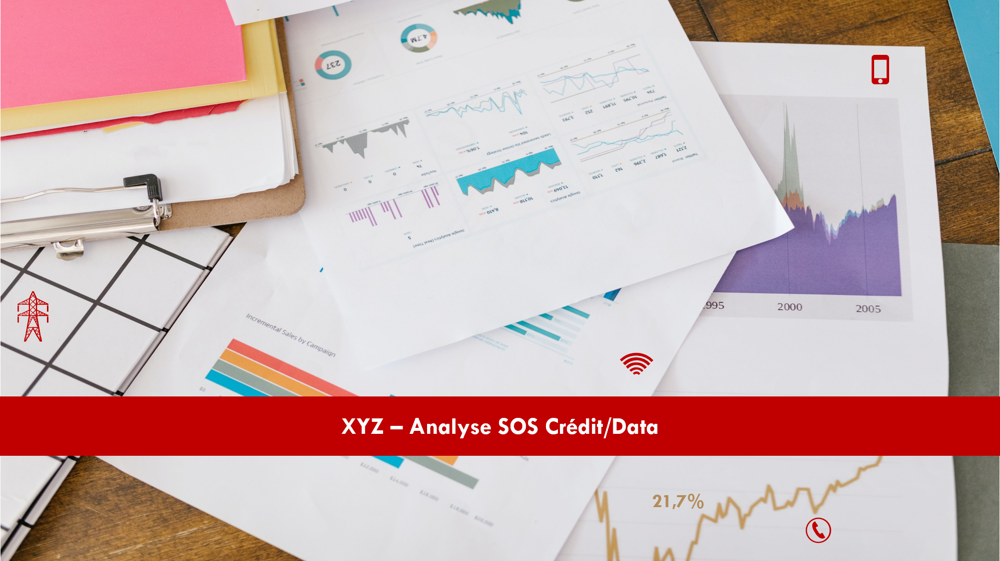

<!DOCTYPE html>

<html lang="fr">

 <head>
  
<link href="https://fonts.cdnfonts.com/css/tw-cen-mt" rel="stylesheet">
                
 </head>	

 <body font-family: 'Tw Cen MT', sans-serif;>

<table align ="Center">
  <tr>
    <td width="450" height="250"  CELLSPACING="0" et BORDER="1"> 
      
    </td> 
  </tr>
</table>

## I. CONTEXTE :  
Les opérateurs téléphoniques implantés dans les pays d'Afrique Sub-saharienne ont pour coutume de mettre à disposition de leurs clients prépayés les services SOS Crédit et SOS Data. Il s'agit d'un service permettant aux clients prépayés d’emprunter du crédit ou des forfaits internet, dont le montant correspondant (en plus d'une commission) sera débité de leurs comptes lors de leurs prochaines recharges de crédit téléphonique.

L'opérateur Téléphonique, que nous appelerons "XYZ", propose tout aussi ce service à sa clientèle via le canal d'un prestataire (ABC), qui détient une plateforme d'analyse et de profilage de la clientèle. Les plateformes de XYZ et ABC échangent des données via une interface API. 

Le processus de gestion du SOS Crédit/Data est décrit sur le graphe ci-après : 

![Process][process_workflow]
 

## II. OBJECTIFS :  
Afin de juger de la pertinence du taux de commissionnement et de la rentabilité de ces services, l’opérateur téléphonique XYZ a souhaité pouvoir analyser de manière plus détaillée les états de reporting, qui sont produits à une fréquence journalière par le système. Ces états de reporting en l'état pouvant être considérés comme des états rapports opérationnelles ne permettent pas de manière intuitive et simple de répondre aux questions principales suivantes posées par le Top Management :
1. Quel est le montant moyen octroyé aux clients pour une année définie ?
2. Quel est le pourcentage moyen de remboursement des SOS Crédit et Data ?
3. Quel est le nombre total de lients ayant déjà utilisé le service SOS crédit et Data ? 
4. Quelle est l'évolution graphique des montants totaux octroyés et remboursés ?
5. Quelle est le forfait Data à succès auprès des clients et quel est le chiffre d'affaires généré ainsi que le taux de remboursement ?
6. etc.

 

## III. PHASE PREPARATOIRE :  
Le fichier [Dataset.xlsx][Dataset] contient le jeu de données utilisées pour cette analyse. Les feuilles SOS CREDIT (RAW) et SOS DATA (RAW) contiennent respectivement les données brutes et non retraitées tel que reçues par les équipes techniques de l'opérateur téléphonique XYZ. 

Les challenges auxquels j'ai pu faire face lors du traitement des données étaient les suivants :
- Informations contenues dans plusieurs cellules fusionnées
- Différents formats (M/D/YYYY et MM/DD/YYYY) des dates à traduire au format français (DD/MM/YYYY)
- Sous-Totaux mensuels pour l'ensemble des informations relatives au SOS Crédit
- Sous-Totaux journaliers et mensuels pour l'ensemble des informations relatives au SOS Data
- En-têtes et Colonnes supperflus

Les feuilles SOS CREDIT (FORMATED) et SOS DATA (FORMATED) contiennent les données retraitées par mes soins et qui ont été chargées dans l'outil Power BI afin de créer les différents Tableaux de bord permettant de répondre aux questions mentionnées ci-haut mais aussi pouvant permetteant de ressortir d'autres KPI.

 

## IV. RESULTATS : 
Les graphes ci-après sont des extraits du Dashboard développé et mis à disposition du Top Management qui leur permettra désormais en toute indépendance de procéder à l'analyse de la pertinence du taux de commissionnement et de la rentabilité des services SOS Crédit et SOS Data.

![KPI][KPI_01]  
![KPI][KPI_02]  

 

## V. DÉMO :  
Le tableau de bord interactif Power BI peut être téléchargé gratuitement et consulté en cliquant sur ce [LIEN][Dashboard]

 

## VI. REMARQUES :  
Pour toute(s) question(s) ou suggestion(s), n'hésitez pas à me contacter sur :
mon profil [LinkedIn][linkedin] ou via mon eMail: sf.kounga@gmail.com

 

## LICENCE

 Ce(tte) œuvre est mise à disposition selon les termes de la <a rel="license" href="http://creativecommons.org/licenses/by-nc-sa/4.0/">Licence Creative Commons Attribution - Pas d’Utilisation Commerciale - Partage dans les Mêmes Conditions 4.0 International</a>.
</body
 
<!-- Image Links -->

[process_workflow]: FILE/SOS_Process.png
[KPI_01]: FILE/Dashboard_SOS_Crédit.png
[KPI_02]: FILE/Dashboard_SOS_Data.png
[Dataset]: FILE/Dataset.xlsx
[Dashboard]: FILE/DashboardSOS.pbix

<!-- Profile Links -->

[linkedin]: https://www.linkedin.com/in/serge-kounga-a26365161
[dashboard_link]: 

</html>
